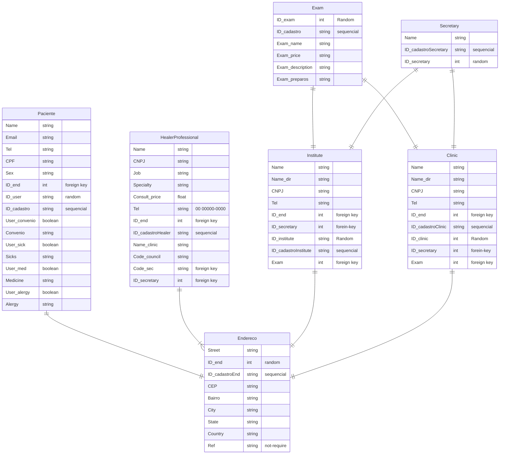

```mermaid
erDiagram
%%wa
    Paciente {
        Name string
        Email string
        Tel string
        CPF string
        Sex string
        ID_end int "foreign key"
        ID_user string "random"
        ID_cadastro string "sequencial"
        User_convenio boolean
        Convenio string
        User_sick boolean
        Sicks string
        User_med boolean
        Medicine string
        User_alergy boolean
        Alergy string
    }

    Endereco {
        Street string
        ID_end int "random"
        ID_cadastroEnd string "sequencial"
        CEP string
        Bairro string
        City string
        State string
        Country string
        Ref string "not-require"
    }

    HealerProfessional {
        Name string
        CNPJ string
        Job string
        Specialty string
        Consult_price float
        Tel string "00 00000-0000"
        ID_end int "foreign key"
        ID_cadastroHealer string "sequencial"
        Name_clinic string
        Code_council string
        Code_sec string "foreign key"
        ID_secretary int "foreign key"
    }

    Secretary {
        Name string
        ID_cadastroSecretary string "sequencial"
        ID_secretary int "random"
    }

    Clinic {
        Name string
        Name_dir string
        CNPJ string
        Tel string
        ID_end int "foreign key"
        ID_cadastroClinic string "sequencial"
        ID_clinic int "Random"
        ID_secretary int "forein-key"
        Exam int "foreign key"
    }

    Institute {
        Name string
        Name_dir string
        CNPJ string
        Tel string
        ID_end int "foreign key"
        ID_secretary int "forein-key"
        ID_institute string "Random"
        ID_cadastroInstitute string "sequencial"
        Exam int "foreign key"
    }

    Exam {
        ID_exam int "Random"
        ID_cadastro string "sequencial"
        Exam_name string
        Exam_price string
        Exam_description string
        Exam_preparos string
    }
    Paciente ||--|| Endereco : ""
    HealerProfessional ||--|{ Endereco : ""
    Institute ||--|| Endereco : ""
    Clinic ||--|| Endereco : ""
    Exam ||--|| Clinic : ""
    Exam ||--|| Institute : ""
    Secretary ||--|| Clinic : ""
    Secretary ||--|| Institute : ""
```

Legenda:
 
1. Id_end: id endereço
2. Ref: Referencia
3. Code_council: Condigo do conselho regional
4. || = 1,1.... |{ 1, *... o| 0,1 .....  o{ 0, *

